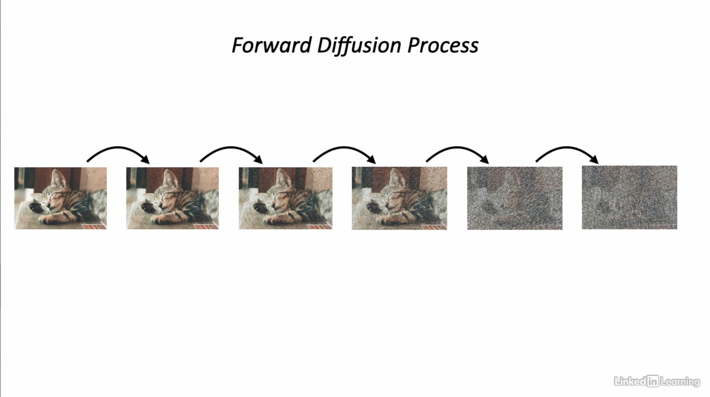
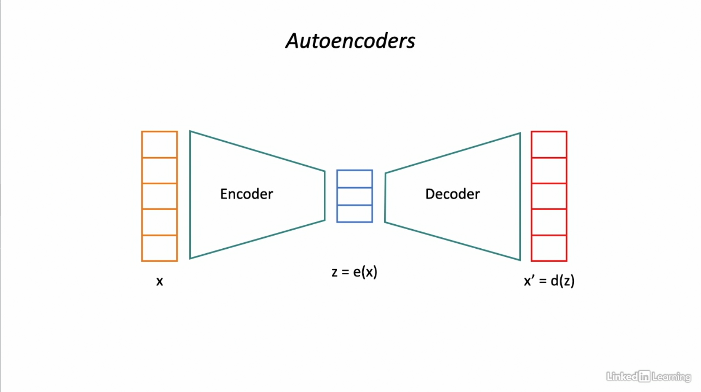
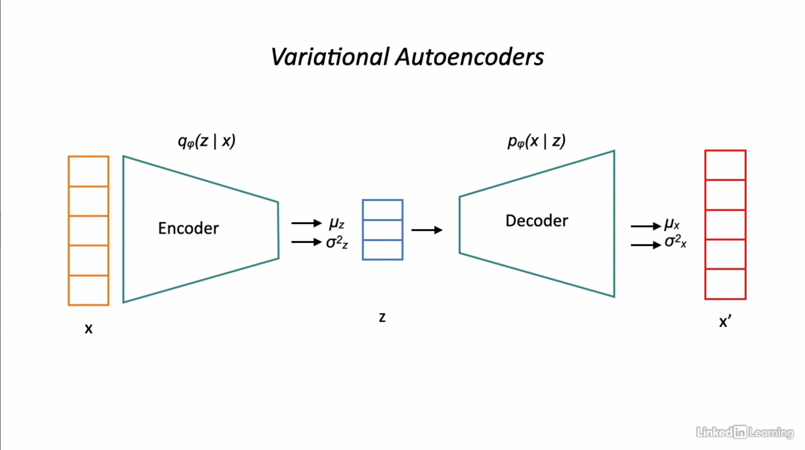

# Denoising Diffusion Probabilistic Models

- [Original paper](https://arxiv.org/pdf/2006.11239.pdf) published in 2020 by Jonathan Ho et al
- Did not claim to be better than GANs
- Many papers since this one, each improving upon the original diffusion model
- Diffusion models better at capturing the breadth of the training data's variance and also beat GANs in image generation tasks according to the paper [Diffusion Models Beat GANs in Image Synthesis](https://arxiv.org/abs/2105.05233)

## Frechet Inception Distance (FID)

- A metric used to assess the quality of images created by a generative model. The FID score *compares the distribution of generated images with the distribution of real images* used to train the generator.
- A perfect FID score is 0.0, which means, lower the score of a model, the better images it generates.

## How do DDPMs Work?

- Start with a base image $x_0$
- Add noise in a very specific way
  - Iteratively in infinitesimal step sizes (usually of the order of 1000 steps in practice)
  - Independent Gaussian noise added at each step
  - With relatively small amplitude noise in each step
  - Until we end with pure noise similar to "static"
  
  

- Is it possible to go in the reverse direction?
  - Start with an image that is pure noise and generates an image from the data distribution?
  - **Reverse Diffusion Process**: Can use a neural network to learn the parameters of the reverse diffusion process
  - Diffusion model is trained to learn the reverse diffusion process
  - Reverse diffusion process can be used to generate data from the original distribution

## Forward Diffusion and Reverse Diffusion

### Forward Diffusion Process

- $x_0 \xrightarrow{\epsilon \in \mathcal{N}} x_1 \xrightarrow{\epsilon \in \mathcal{N}} x_2 \xrightarrow{\epsilon \in \mathcal{N}} ...\xrightarrow{\epsilon \in \mathcal{N}} x_T$
- Large sequence of time steps typically of the order 1000-4000
- The final $x_T$ is pure noise, $q(x_T|x_0) \approx \mathcal{N}(0,1)$
- The forward diffusion process is modeled as a **Markov Chain**
- *A Markov Chain is a stochastic model describing a sequence of events where the probability of each event depends only on the previous state*
- Each transition is a Gaussian with a Mean and Variance
  $$q(x_t | x_{t-1}) = \mathcal{N}(x_t; \sqrt{1-\beta_t}x_{t-1}, \beta_tI)$$
    - where $\beta_t$ is the variance added using a predefined schedule and is a hyperparameter of the training process, $beta_1 \lt \beta_2 \lt ... \beta_t$ and $\beta_t \in (0, 1)$
    - and mean is $\sqrt{1-\beta_1}$, which will be non-zero and less than 1 and will fall for each time instance
- As $T \rightarrow \infty$, $q$ will approach a Gaussian with mean 0 and variance 1.

### Reverse Diffusion Process

- Start with pure noise $x_T$ and generate an image from the data distribution
  $$x_0 \leftarrow x_1 \leftarrow ...\leftarrow x_T$$
- The reverse diffusion process is also modeled as a Markov Chain
- Neural Network to learn the parameters of the Transition $p_\theta(x_{t-1}|x_t)$
- Each transition is a Gaussian with a Mean and Variance
  $$p_\theta(x_{t-1}|x_t) = \mathcal{N}(x_{t-1}; \mu_{\theta}(x_t, t), \Sigma_\theta(x_t, t))$$
- Model learns to undo the noise added at individual time steps
- Objective of the Reverse Process: *Use a neural network to learn the mean and variance of the denoising process in order to generate images from noise*

  
- NOTE: **Forward diffusion process and Reverse diffusion process have the same functional form**

## Training a Diffusion Model: Intuition

- **Reverse Diffusion Process** $p_\theta(x_{t-1}|x_t) = \mathcal{N}(x_{t-1}; \mu_{\theta}(x_t, t), \Sigma_\theta(x_t, t))$
- Diffusion model is trained to learn the parameters of the reverse diffusion process.
- Model the Diffusion Model as a Latent Variable Generative Model
  - Observed variable: $x_0$
  - Latent variables: $x_1, x_2, x_3, ..., x_T$
  - Model the diffusion model as a *Variational Autoencoder (VAE)*
  - **Autoencoders**
    - Autoencoders are neural networks used for dimensionality reduction
    - Input fed into the neural network is encoded in lower dimensionality
    - Encoding represents latent features of the input
    - Lower dimensionality represent the latent/significant features of the input
    - Latent features are those features which capture as much information as possible that is present in the original input, but use lower dimensionality to represent the original input.
    - Latent features used to regenerate original input
    
    

  - **Variational Autoencoders (VAEs)**
    - *Probabilistic autoencoders* - outputs partially determined by chance even after training
      - Output of VAE may not be the same as the original input (probabilistic output)
      - For same input, outputs may be different at different times
    - *Generative autoencoders* - can generate new instances which look like the training data
    
    

    - Instead of producing a coding from the input, encoder produces a distribution over a latent variable $z$. Distribution has mean $\mu_z$ and standard deviation $\sigma_z$
    - Actual coding sampled randomly from the Gaussian distribution for latent $z$
    - Decoder decodes the sampled coding by producing a distribution over data $x$ given $z$
  
  - Forward diffusion process produces latents from data
  - Reverse diffusion process data from latents
  - Forward process is fixed (encoder is not trained)
  - Reverse process (decoder) has to be trained

