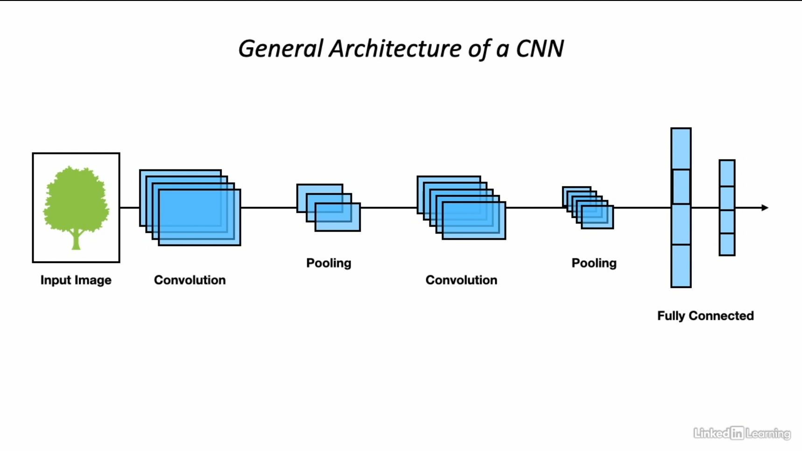
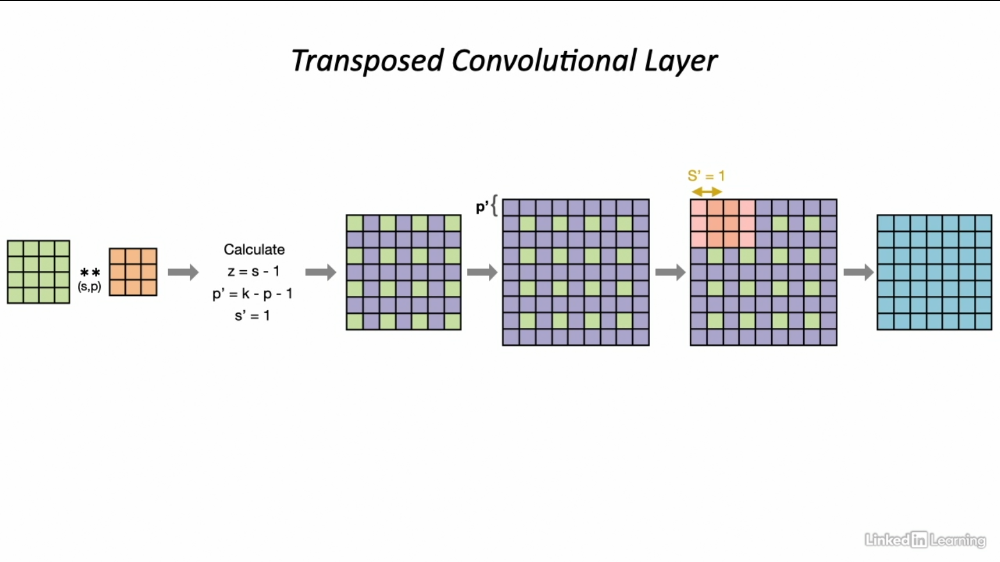
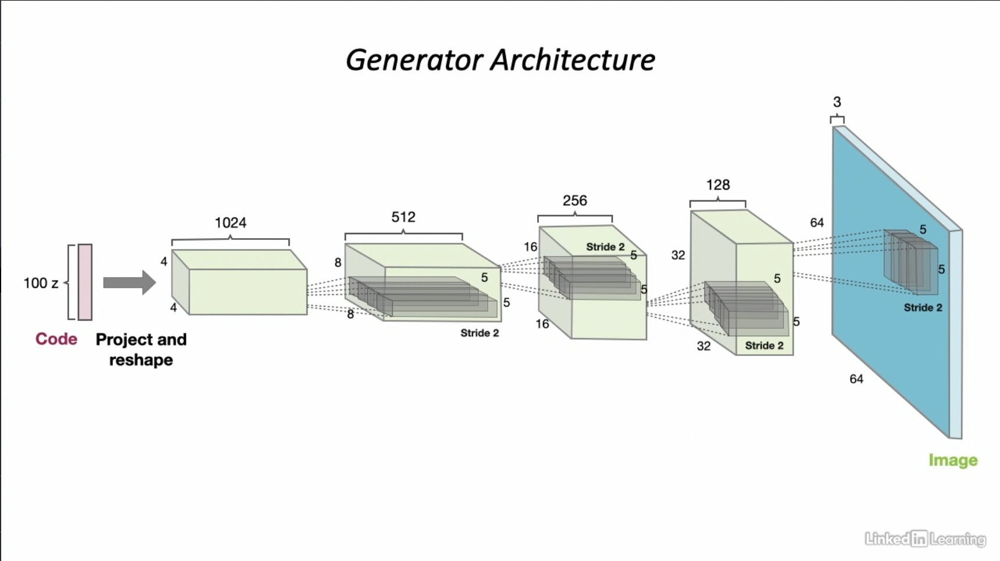
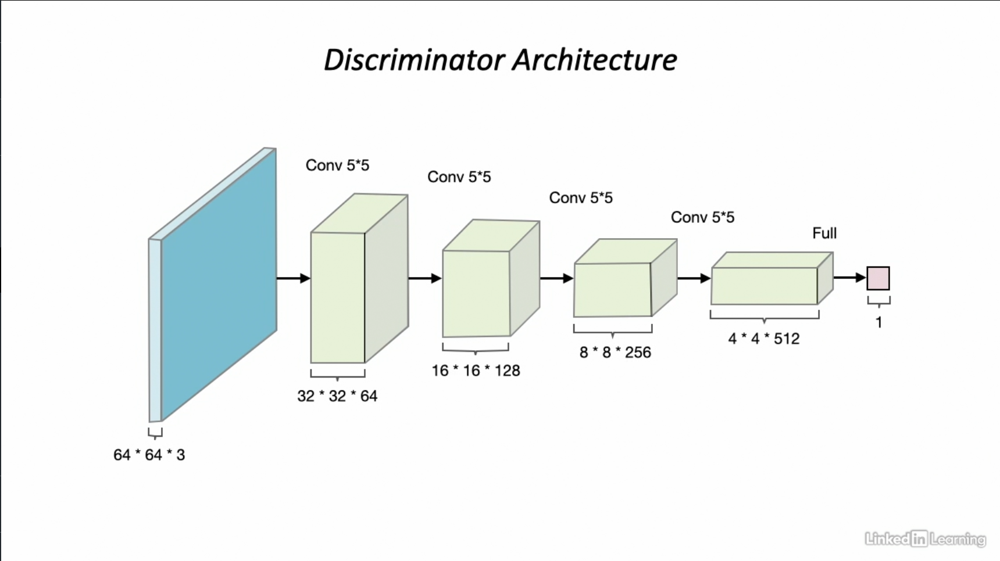

# Deep Convolutional Generative Adversarial Networks

## Overview of Convolutional Neural Networks

* CNNs are the neural network architecture that is primarily used for image recognition and processing tasks
* CNNs can capture location-invariant spatial features
* CNNs comprises of 2 main layers: *Convolutional layers* and *Pooling layers*

### Convolutional Layers

* Involves sliding a kernel over the input image
* Weights of the kernel found during training process
* Sliding kernel helps extract features from the underlying image
* Generates feature map representations of the input image

### Pooling Layers

* Reduces the sample size of the input
* Usually performs some kind of aggregating operations
* Example: Average pooling, Max pooling etc.
* Reduces the number of parameters the network has to deal with

### Types of Convolutional Layers

#### 1. Standard Convolutional Layer

* Applies a sliding kernel to the input in order to extract features from the underlying image

#### 2. Deconvolutional Layer

* Reverses the operation of a standard convolutional layer. Takes in a feature map as an input and produces the original input used to generate the feature map

#### 3. Transposed Convolutional Layer

* A layer used to perform upsampling of input data i.e., to generate an output feature map that has spatial dimension greater than that of the input feature map

    

## DCGAN

* GAN where each adversary is a CNN with certain architectural constraints. These constraints help the adversarial pair learn a hierarchy of representations which help create better generated images.
* Uses the same principles as GANs - generator and discriminator as adversaries.
* [Original paper](https://arxiv.org/pdf/1511.06434.pdf) by Alec Radford et.al

### Model Architecture

1. Replace pooling layers with strided convolutions
   - Pooling layers found to hurt model convergence
   - Strided convolutional layers used for upsampling input (transposed convolutions)
2. Use batch normalization for generator and discriminator
   - Recenters the output of each layer to have a mean zero and unit variance
   - Mitigates issues due to poor initialization
   - Allows propagation of gradients through deeper layers i.e. mitigates vanishing gradients
   - Applied to all layers except generator output layer and discriminator input layer
3. Remove fully-connected hidden layers for deeper architectures
   - No fully-connected layers at the end of the convolutional layers
   - Generator uses a single dimensional noise input
   - Reshaped to a 4-dimensional tensor (start of the convolutional track)
4. Use ReLU activation in the generator for all layers except output layer which uses tanh activation
5. Use LeakyReLU activation in the discriminator

    
    

