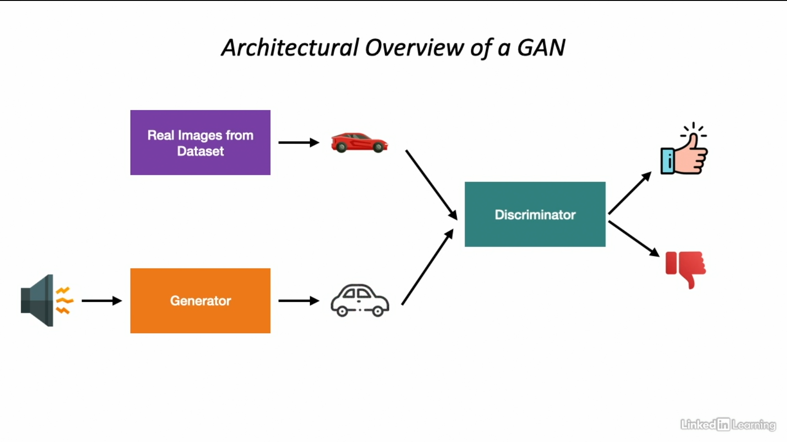

# Generative Adversarial Networks

* A machine learning model in which two neural networks compete with one another to become more accurate in their predictions-the two networks play a zero-sum game.

## Applications of GANs

* Generating realistic images of humans, cartoons, etc
* Text to image translation
* Photo inpainting
* Generating 3D objects from 2D images

## The Adversaries in a GAN

### Generator

* Learns to generate plausible data
* Data serves as negative samples to train the discriminator work
* Improves the quality of samples during the training process
* Till the discriminator finds it hard to tell generated data from real data

### Discriminator

* Learns to distinguish the generator's fake data from real data
* Penalizes the generator for generating implausible data-thus forcing the generator to improve
* During the training process, discriminator's ability to tell apart real from fake steadily falls
* Till the discriminator is unable to tell fake and real data apart

## Architecture overview

## Training

* There are two loss functions: *Discriminator loss* and *Generator loss*
* Loss functions for both the losses can be same or different

### Training the Discriminator

* Training data comes from two sources: 
  * Real data instances from a real dataset
  * Fake data instances created by the generator
* Maximizes the probability of real data being classified as real
* Minimize the probability of fake data being classified as real

### Training the Generator

* Tightly integrated with the discriminator:
  * Random noise fed into generator
  * Generator generates image from noise
  * Discriminator classifies the generated data
  * Generator penalized for not fooling the discriminator
* Maximizes the probability that fake data is classified as real

### Loss functions

* Binary crossentropy (more used practically)
* Minimax loss (proposed in original GAN paper)
* Wasserstein loss

## Problems with GANs

1. **Vanishing Gradients**
   * If the discriminator works too well then generator can fail due to vanishing gradients
   * Discriminator does not provide enough information to improve on training
   * Solved using improved loss functions
     * modified minimax loss
     * Wasserstein loss function

2. **Mode Collapse**
    * Ideally GANs should produce different outputs for each random input
    * However generator might learn just one plausible input and always produce the same one
    * Generator over-optimizes for discriminator and always produces a small number of outputs
    * Solved using different techniques
      * Improved loss functions like Wasserstein loss
      * Unrolled GANs where generator loss incorporates outputs of future discriminators
  
3. **Failure to Converge**
   * GAN convergence is a major source of failure
   * As the generator improves with training-the discriminator feedback gets worse
   * Discriminator might, at some point, give random feedback
   * Generator might train on this random feedback and its quality might degrade
   * Solved using:
     * Adding noise to discriminator inputs
     * Penalizing discriminator weights