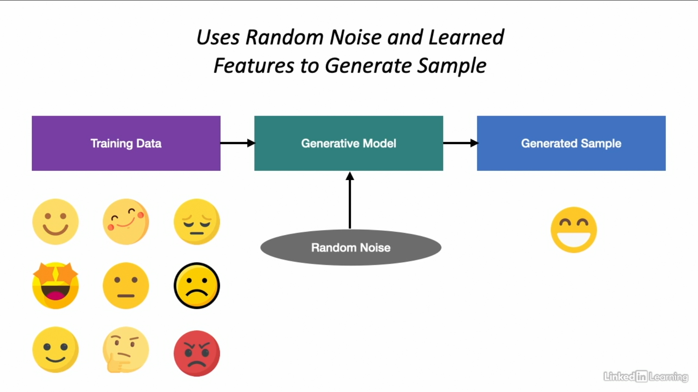

# Overview

#### *Discriminative Models*
* A discriminative model is a statistical model that determines the boundaries in observed data and uses these boundaries to make decisions and predictions.
* Eg-Regression models, Classification models

#### *Generative Models*
* A generative model describes how a dataset is generated in terms of a probabilistic model, sampling from the model allows us to generate new data that did not exist before.
* Eg-Generative Adversarial Networks, Diffusion models

    

* Generative models are *probabilistic* in nature rather than deterministic
* Deterministic models would apply the same computations on input and produce the same result
* Probabilistic models must incorporate a random element which creates new entities

#### Application of Generative Models
* Upsampling imbalanced datasets
  * Datasets used for machine learning may not represent the real population accurately
  * Models built on imbalanced data may be biased
  * Generative models can create new data modeling the true distribution of data
  * Can be used to generate new samples to reshape datasets and reduce skewness
  
* Imputation of missing values
  * Data in real world is often dirty-contains missing values, outliers
  * Dropping records with missing values often not an option-results in skewed data and poor models
  * Generative models can replace missing values with synthetic values
  * New generated values retain the statistical properties of the original data
  
* Anonymizing sensitive datasets
  * Generative models enable powerful anonymization of datasets
  * Better than traditional masking and grouping techniques
  * Model can be trained on original data and generate new samples resembling original
  * Reduces the chances of data leakage for sensitive data